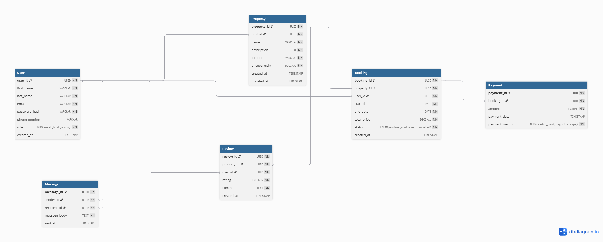

# Airbnb Database ER Diagram

**Objective:**  
Create an Entity-Relationship (ER) diagram based for the Airbnb database specification showing entities, attributes, primary keys, foreign keys, and relationships.

## Description

This ER diagram includes the following entities:  
- User  
- Property  
- Booking  
- Payment  
- Review  
- Message  

Relationships:  
- Each Property belongs to a User (host).  
- Each Booking links a User (guest) to a Property.  
- Payments are linked to Bookings.  
- Reviews are linked to Users and Properties.  
- Messages are exchanged between Users.

## ER Diagram

